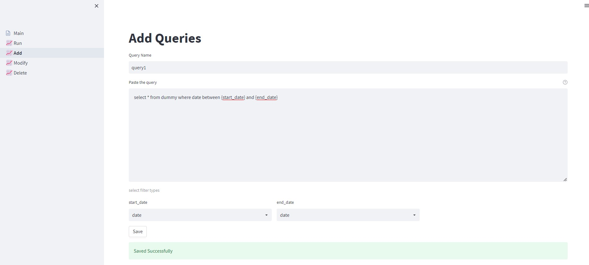

CRUD operation with streamlit to save query snippets and query with Hive

Connection String
`presto.connect(host='Presto Host',port=PORT,username='USER_NAME')`
&nbsp;
&nbsp;

Dashboard consists of Run,Add,Modify and Delete pages for CRUD operations.

&nbsp;

Run

Add

Modify

Delete

Todo
- Hive querying logic to be implemented.
